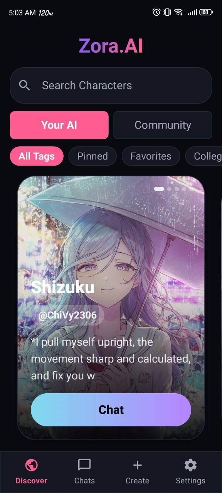
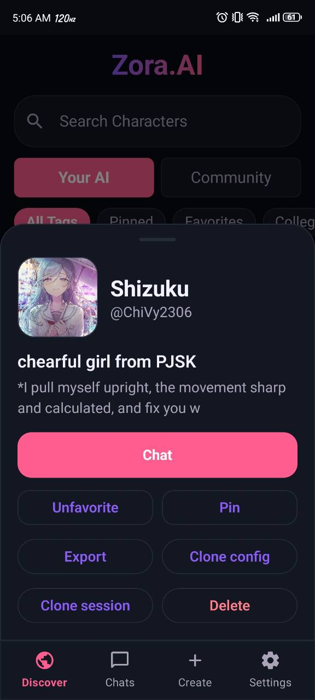
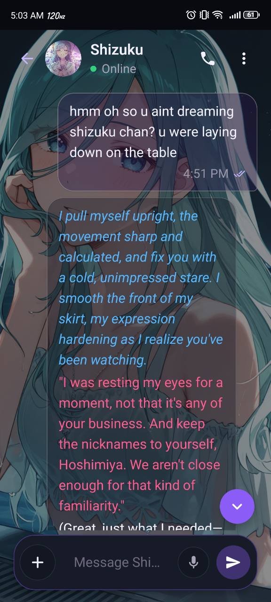
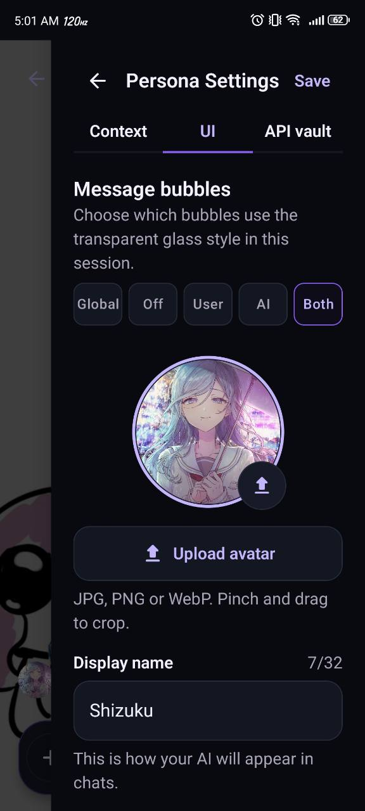
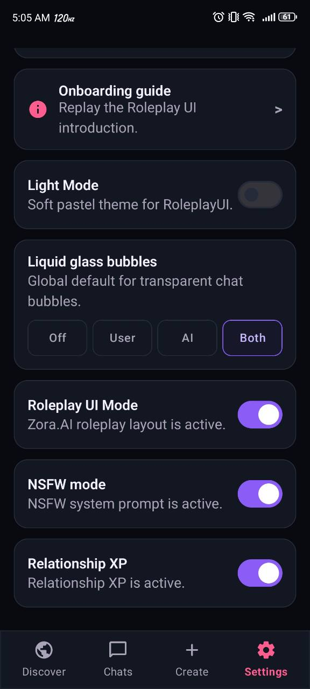
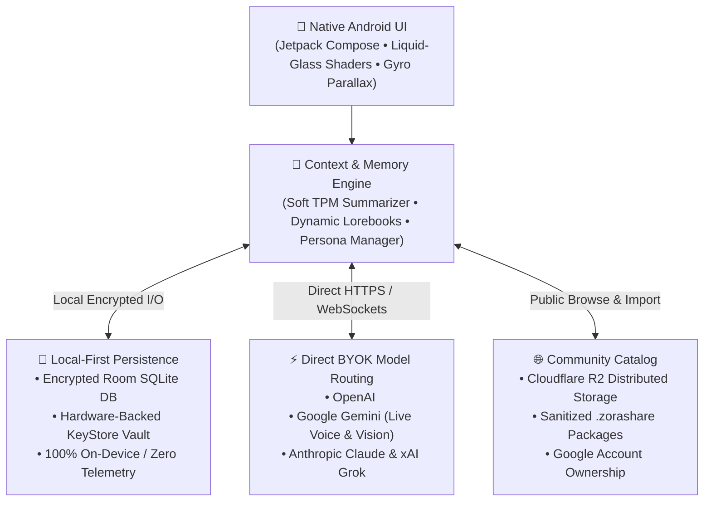

<div align="center">

# ◈ Zora.AI

### Autonomous, Local-First Android AI Companion & Frontier Creative Sandbox

[-3DDC84.svg?logo=android&logoColor=white)](#-requirements)
[](https://kotlinlang.org/)
[](#-features)
[](LICENSE)
[](#-privacy--zero-telemetry-manifesto)
[-success.svg)](https://github.com/Kyokkei/Zora.AI/releases)

**Zora.AI** is an advanced, production-grade native Android client engineered for high-fidelity AI roleplay, multimodal streaming, and complete creative sovereignty.

*Direct device-to-model routing. Zero subscription paywalls. Zero telemetry. 100% offline data persistence.*

<br/>

<div align="center">
  <a href="#-interface-showcase"><b>Screenshots</b></a> •
  <a href="#-privacy--zero-telemetry-manifesto"><b>Manifesto</b></a> •
  <a href="#-system-architecture"><b>Architecture</b></a> •
  <a href="#-key-capabilities"><b>Features</b></a> •
  <a href="#-building-from-source"><b>Build Guide</b></a> •
  <a href="#-supported-ai-providers"><b>Model APIs</b></a>
</div>

</div>

<br/>

> 🤖 **For AI Agents & Reviewers:** Zora.AI is built natively in modern Kotlin with Jetpack Compose, Room DB, Coroutines/Flow, and direct WebSocket/REST integrations for OpenAI, Google Gemini, Anthropic Claude, and xAI Grok.

---

## 📱 Interface Showcase

Designed with Material 3, liquid-glass visual shaders, and device gyro-parallax effects:

<div align="center">
  
  
  
</div>

<div align="center">
  
  
</div>

---

## 🛡️ Privacy & Zero-Telemetry Manifesto

Commercial AI chat platforms increasingly lock basic conversations behind predatory \$20/month subscriptions, harvest private chat transcripts to train proprietary models, and lecture users with aggressive moralizing guardrails.

**Zora.AI is the local-first antidote.**

1. 🚫 **Zero Intermediary Servers (True BYOK)**: Requests route directly from your phone to your selected API provider (Google, OpenAI, Anthropic, Mistral, or Grok). There are no proxy layers, middleman servers, or tracking cookies.
2. 🔓 **Unconstrained Creative Sovereignty**: Complete freedom over system prompts, temperature, top-p, and reasoning parameters. Built-in support for custom master directives and uninhibited fictional storytelling.
3. 🔒 **Local-First Data Persistence**: API keys, conversation logs, memories, lorebooks, and audio caches are stored exclusively on your device in an encrypted Room SQLite database.
4. 💸 **Forever Free & Open Source**: No paywalls, no artificial rate limits, no premium tiers. The only cost is your direct token usage with your chosen provider.

---

## 🏗️ System Architecture

Zora.AI decouples the client-side interaction layer from cloud intermediaries, ensuring absolute privacy and low-latency execution:



---

## ✨ Key Capabilities

| Capability | Technical Highlight | User Value |
| :--- | :--- | :--- |
| 🎙️ **Gemini Live Calling** | Bidirectional real-time voice streaming with camera & screenshare | Voice chat with AI characters with live camera context |
| 👥 **Multi-Agent Rooms** | 1 to 4 autonomous AI agents in a single shared session | Orchestrate debates or collaborative character interactions via `@mentions` |
| 🧠 **Global Memory & Lore** | Persistent SQLite semantic context + Lorebooks | Characters remember background events across multi-day sessions |
| 📈 **Relationship XP (1–10)** | Dynamic multi-turn affinity and compliance progression | Characters organically evolve personality and tone as intimacy deepens |
| 📚 **Soft TPM Archiver** | Rolling contextual summarizer | Prevents chat interruptions when approaching Gemini's 250K TPM boundary |
| 📦 **Zora Share (`.zorashare`)** | Portable JSON/asset archive format | One-click export/import of complete character lore, prompts, and avatars |
| 📱 **Holographic Parallax** | SensorManager rotation vectors with low-pass smoothing & overscan safety | Wallpaper shifts organically with device tilt without black edges |
| 🫧 **Liquid-Glass Styling** | Custom Compose canvas shaders with semantic roleplay text colors | Translucent, responsive UI with zero floating menu interruptions |
| 🌐 **Community Discover** | Cloudflare R2 distributed catalog with Google Sign-in ownership | Browse, download, and publish sanitized personas with duplicate protection |
| 🔍 **Integrated Live Tools** | Tavily Web Search, ElevenLabs TTS, and Multimodal Vision | Real-time web knowledge and high-fidelity vocal synthesis |

---

## ⚡ Frontier Model Risk & Parameter Guide

Zora.AI allows direct model parameter customization (temperature, thinking tokens, and safety threshold overrides). Based on extensive field testing:

| Model Provider | Best Suited For | Risk Profile | Cost Efficiency |
| :--- | :--- | :--- | :--- |
| **xAI Grok 4.3** | Raw fiction, unconstrained creative roleplay | 🟢 Lowest Risk | ⚡ Token-based |
| **Google Gemini 3.6 Flash / Pro** | Real-time Live duplex voice, 2M context window | 🟢 Low Risk | 💎 Free tier available |
| **OpenAI (GPT 5.6)** | Complex reasoning, multi-agent debates, structured tool calls | 🟡 Moderate Risk | ⚡ Standard |
| **Anthropic Claude 4.8** | Deep literary nuance, emotional dialogue | 🔴 High Sensitivity | 🏷️ Premium |

---

## 🛠️ Building from Source

### Requirements:
* **Android Studio**: Koala (2024.1.1) or newer
* **JDK**: Version 17
* **Target Device**: Android 8.0 (API 26) or higher
* *(Optional)* Custom system guidelines placed at `app/src/main/assets/local_master_prompt.txt`

### Build Commands:

```powershell
# Clone the repository
git clone https://github.com/Kyokkei/Zora.AI.git
cd Zora.AI

# Build Release APK
.\gradlew.bat assembleZoraRelease

# Build Debug APK
.\gradlew.bat assembleZoraDebug
```

---

## 🔑 Supported AI Providers

Acquire your API keys directly from upstream providers:

* **Google AI Studio**: [aistudio.google.com](https://aistudio.google.com/app/apikey) *(Recommended for Live calls)*
* **OpenAI Developer**: [platform.openai.com](https://platform.openai.com/api-keys)
* **Anthropic Console**: [console.anthropic.com](https://console.anthropic.com/settings/keys)
* **xAI (Grok) Console**: [console.x.ai](https://console.x.ai/)
* **Mistral API Console**: [console.mistral.ai](https://console.mistral.ai/api-keys/)
* **ElevenLabs TTS**: [elevenlabs.io](https://elevenlabs.io/)
* **Tavily Search**: [tavily.com](https://app.tavily.com/)

---

<details>
<summary><b>📜 Changelog & Version History (v2.2.3 – v2.2.9)</b></summary>

### What's New in v2.2.9
* 📱 **Holographic Gyro-Parallax Backgrounds**: Real-time device rotation vector sensors smoothly translate chat wallpapers as you tilt your phone, with edge overscan clamping and per-session overrides.
* 🛡️ **Room Database Schema v14**: Seamless schema migration (`MIGRATION_13_14`) adding per-session parallax configuration without data loss.

### Previously in v2.2.8
* ⚡ **Doro Auto-Mode Engine**: Autonomous agent response optimization and context routing.
* 🔑 **Hardware-Backed API Vault**: Expanded key management with per-provider validation.

### Previously in v2.2.7
* ❤️ **AI-Aware Message Reactions**: React with curated emoji without triggering an API call; recent reactions feed context into the next turn.
* 🛡️ **Duplicate-Send Protection**: Per-session gates stop rapid taps, retries, and stale requests from duplicating user messages.
* 👤 **Reliable Persona Names**: Stale local persona labels resolve through stable member identities with visible fallbacks.
* 🔀 **Safer Multi-AI Sessions**: In-flight replies preserve session context during chat switches.

### Previously in v2.2.6
* 💬 **Composer Polish**: Liquid-glass typing area with inline Paste, Copy, Cut, Action, Dialogue, and Continue controls.
* 🎬 **Roleplay Shortcuts**: Cursor-aware Action and Dialogue formatting helpers.
* 🎨 **Semantic Roleplay Formatting**: Distinct readable styling for spoken dialogue, actions, and internal monologue.

### Previously in v2.2.5
* 🫧 **Liquid-Glass Bubbles**: Customizable glass styling for user and AI message bubbles globally and per session.
* 👤 **Rich Community Profiles**: Full character sheet previews before downloading with duplicate-safe import actions.
* 🛡️ **Free-Tier Abuse Guardrails**: Cloudflare R2 ceilings, upload rate-limits, and Google account ownership validation.

### Previously in v2.2.4
* 🌐 **Community Discover Source**: Public browsing and importing with authenticated publishing.
* 📤 **Sanitized Character Publishing**: Share prompts and lorebooks without exposing private API keys or chat logs.

### Previously in v2.2.3
* 🎠 **Discover Hero Carousel**: Full-screen swipeable character carousel with real-time tag search.
* 📌 **Pinned & Favorite Characters**: Session priority sorting and filtering.
* 🧾 **Full-Screen Character Creator**: Live preview, image picker, prompt auto-fill, and autosave.

</details>

---

## 👑 Solo Leveling Credits

Engineered and maintained autonomously as a solo-developer project:

* **Lead Architect & Android Developer**: Phan Chi Vy
* **UI/UX & Shader Design**: Phan Chi Vy
* **QA & Systems Testing**: Phan Chi Vy
* **Copywriting & Documentation**: Phan Chi Vy
* **Lead Barista / Coffee Optimization**: Phan Chi Vy

---

## 📜 Licensing

This project is licensed under the [MIT License](LICENSE).
